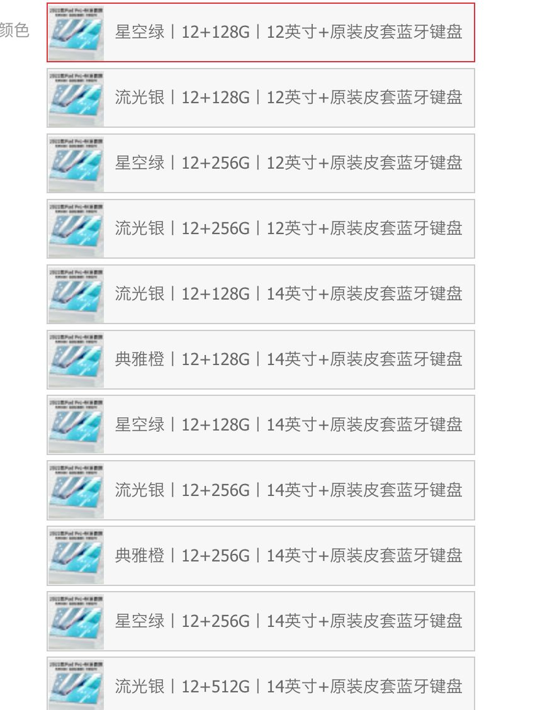
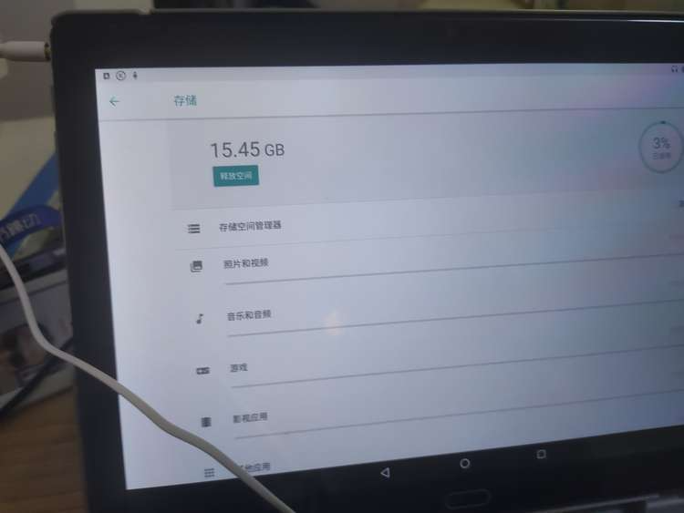
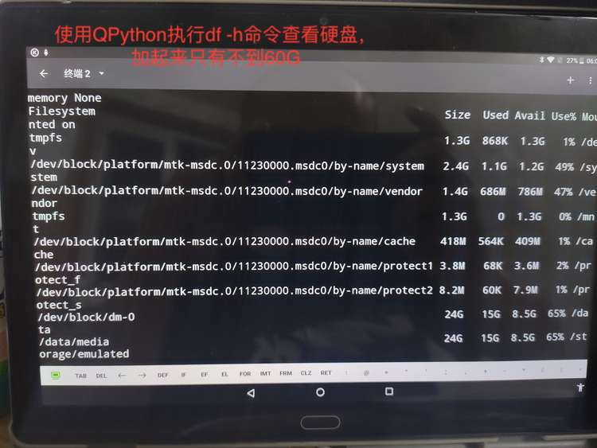
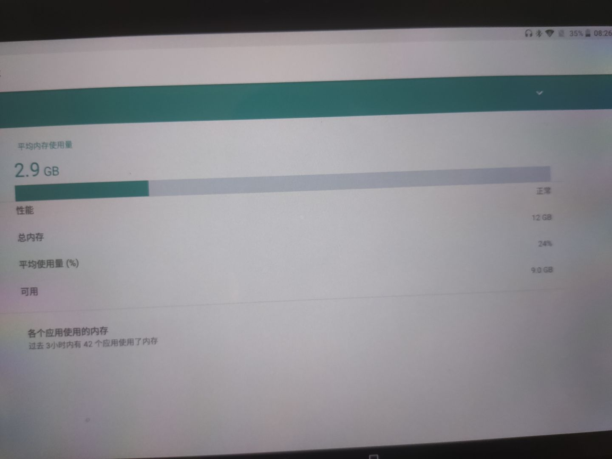
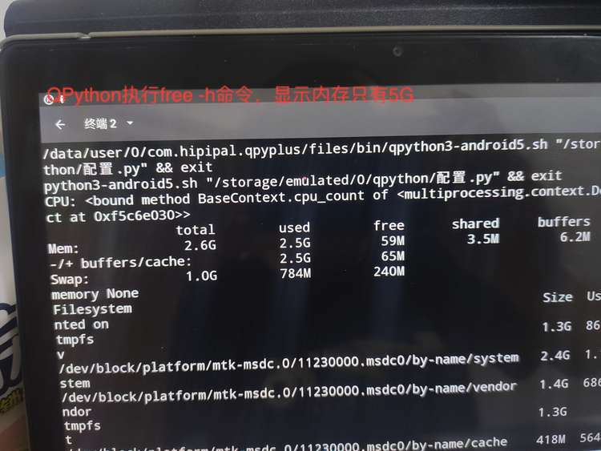
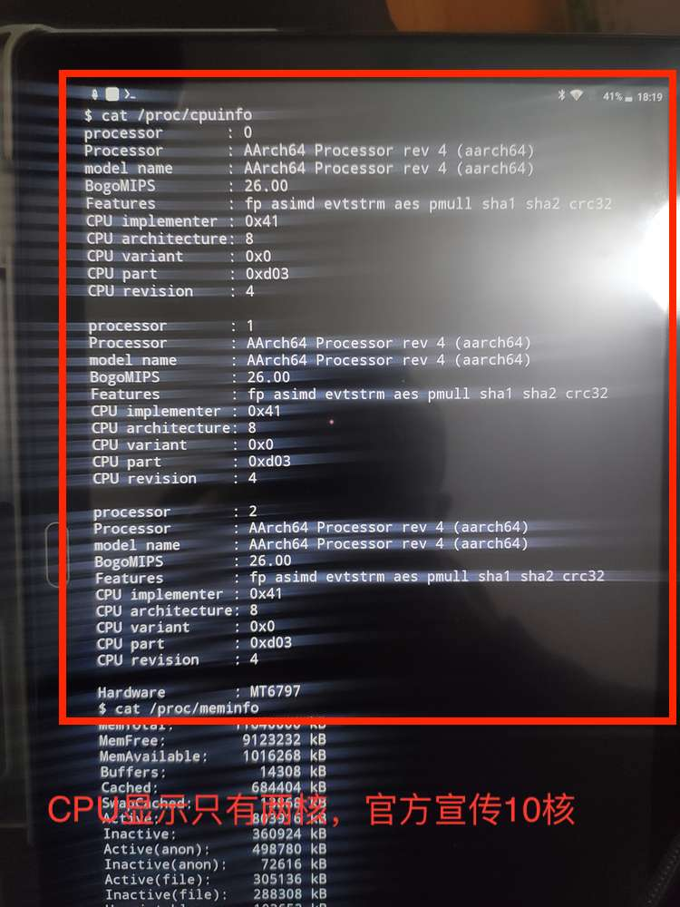
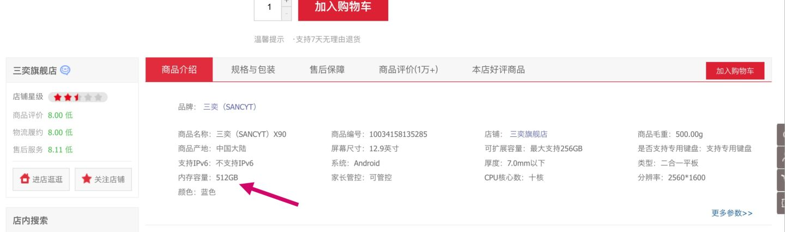

# 记京东买平板被坑的一次经历

去年六月份，心血来潮，在京东买了一个平板。配置：512G硬盘，12G内存，价格1362元。

刚买来时比较欣喜，配件中有鼠标、键盘、皮套等。虽然用起来确实会感到卡顿，但是看一下系统配置却又确实是符合预期：内存12G，硬盘512G。半年间我只是偶尔用一下，感觉还是使用手机更流畅些。

最近几天，翻开吃土的平板，安装了一个QtPython，这是一个在Android系统上运行的Python IDE环境。
Python在手，天下我有。我开始使用Python执行一些系统命令来查看系统配置，一看之下，大吃一惊。
先看一下系统配置里面显示的存储空间大小，目前已用15G，15.45/0.03=515G。

使用df -h命令查看磁盘大小：
`import subprocess as sp sp.check_call("df -h",shell=True)`

加起来只有55G的硬盘大小。

接下来再看一下内存大小。在设置里面确实可以看到内存是12GB，然而平均内存使用量只有2.9G，平均使用量只有24%。  

使用free -h命令查看内存大小。  
`import subprocess as sp sp.check_call("free -h",shell=True)`

内存+cache+Swap总共只有6G（当然Swap不应该算在内存里面）。
因为CPU核心数没有细看，记得应该说是10核。使用python查看cpu数   
`import subprocess as sp sp.cpu_count()`   
结果只有两核。怪不得这么卡。

时间过去太久，已经无法退货。  
通过这次失败的购物经历，我总结了一些经验教训，希望大家不要再上当。

## 买到电子产品之后需要考虑检查的指标
1. CPU核数：现在移动端至少4核，小于4核都属于次品。    
2. 内存大小：内存小是卡顿的主要原因，打开的应用多了内存装不下，频繁切换程序就会导致卡顿。内存至少4G才够用。  
3. 硬盘大小：可以存储多少图片、多少资源，如果硬盘太小，过一段时间就需要清理一下硬盘，经常需要删东西。一般而言，256G是够用的，128G则不够用。  

## 如何查看设备的指标
1. 通过系统设置查看，这种方式看到的有可能是虚标的。  
2. 通过程序查看，常用的程序有两种：termux和QPython。这两个工具都可以在本仓库中找到。  
   1. termux：是一个Android端的命令行工具，Android系统底层就是Linux，termux就是一个linux终端，可以使用`df -h`查看硬盘，使用`free -h`查看内存，使用`cat /proc/cpuinfo`查看CPU信息。   
   2. QPython是一个Python命令行工具，可以执行Python终端。  
## 不良商家会通过修改系统配置的方式欺骗消费者
对于普通用户，查看系统配置的方式就是在设置的UI界面里面查看。从这一层是无法看出问题的，这种方法看到的指标都是虚标的。出厂的时候这些数据是可以被篡改的。   
有些不良商家会通过修改系统配置的方式让系统变得”高配“，这是明目张胆的欺骗消费者。只不过它打赌大部分消费者无法通过其它方式来判断内存、硬盘的大小。  

## 京东商品也要小心
以前我的电子商品大都是京东上购买的，生活用品用淘宝比较多。原因是京东上正品较多，感觉靠谱很多。
实际上，我们依旧不能放松警惕。京东上也有很多骗子商家，也有很多假冒伪劣产品。我们依旧需要擦亮眼睛，谨慎辨别。  
## 保价不可信
京东上有很多产品打着保价的幌子吸引消费者，声称商品多长时间内不会降价。实际上操作空间很大，直接把旧商品下架，然后上一个新商品，实际上是新瓶装旧酒，至于新商品的价格那就可以随意降价了。旧商品确实没有降价，而是下架了。
这款平板现在已经下架了，上架了与原来描述几乎一致的新商品，只不过价格由1362元变成了639元。半年之内，价格降了一半。
[2022新款12G+512G【国行原装】14英寸超清全面屏安卓5G全网通游戏娱乐三奕二合一平板电脑 星空绿丨12+128G丨12英寸+原装皮套蓝牙键盘【图片 价格 品牌 报价】-京东](https://link.zhihu.com/?target=https%3A//item.jd.com/10034158135285.html%23none)

##  京东对于商品简介的审核非常不严格
在商品介绍中，竟然赫然写着内存512G。实际上应该是硬盘512G。如此低级的错误，可以看出京东的商品审核团队是多么的不认真。

## 购买商品之后应该第一时间检查质量
大部分商品都是7天无理由退货，而我现在都已经过去半年了，再想退货就很困难了。   
买了商品，应该尽快查看、试用，如果不满意，尽快执行退货退款的流程，千万不要拖延症把事情抛诸脑后，等想起来的时候为时已晚。  